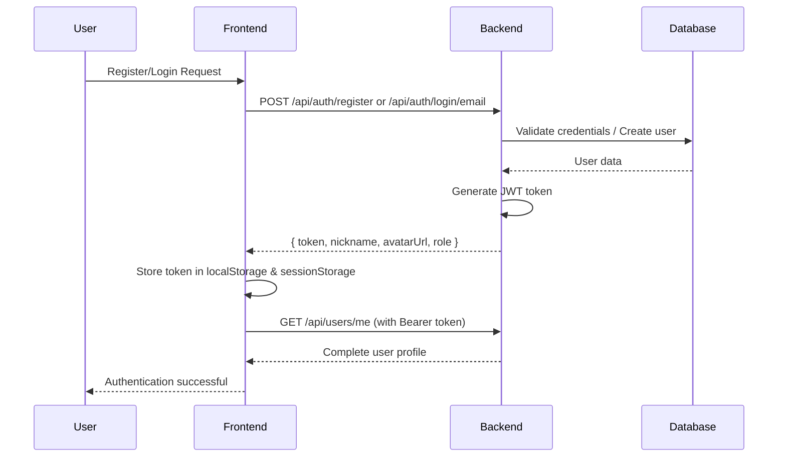

# 🔐 Authentication & Security

This document provides a comprehensive overview of the authentication and security mechanisms implemented in the **Munich Weekly** platform, based on the current codebase implementation.

## 📚 Documentation Navigation

**Quick Overview:** For an executive summary, see [Security Summary](./security-summary.md)

**Related Documentation:**
- 🏠 [Project Overview](../README.md) - Main project documentation and feature overview
- 🚀 [Deployment Guide](./deployment.md) - Production security configuration and SSL setup
- 🛡️ [Privacy Policy](./privacy.md) - GDPR compliance and user data protection
- 📦 [API Reference](./api.md) - Complete endpoint documentation with security requirements
- 📱 [Frontend Overview](./frontend-overview.md) - Client-side authentication implementation

---

## 1. Overview

The Munich Weekly platform implements a multi-layered security architecture that supports both authenticated and anonymous users:

- **Authenticated Users**: Full access using JWT-based authentication
- **Anonymous Users**: Limited access with anonymous voting capabilities using cookie-based visitor tracking
- **Role-Based Access Control**: User and admin roles with different permission levels
- **Secure Password Management**: BCrypt hashing with secure password reset functionality

---

## 2. JWT Authentication System

### 2.1. Token Configuration

- **Signing Algorithm**: HS256 (HMAC SHA-256)
- **Default Expiration**: 1 hour (3600000ms)
- **Secret Key**: Configurable via `JWT_SECRET` environment variable
- **Library**: `io.jsonwebtoken:jjwt` (version 0.11.5)

### 2.2. Token Structure

```json
{
  "header": {
    "alg": "HS256",
    "typ": "JWT"
  },
  "payload": {
    "sub": "42",        // User ID (primary key)
    "iat": 1714600000,  // Issued at timestamp
    "exp": 1714686400   // Expiry timestamp
  }
}
```

### 2.3. Frontend Token Management

**Storage Strategy**:
- Primary: `localStorage` for persistent authentication
- Fallback: `sessionStorage` for session-based authentication
- Automatic token expiration checking (30-second buffer before actual expiry)

**Token Usage**:
```typescript
// Token retrieval and header generation
const getAuthHeader = (): Record<string, string> => {
  const token = localStorage.getItem("jwt");
  return token ? { Authorization: `Bearer ${token}` } : {};
};
```

**Storage Resilience**:
- Graceful handling of private browsing mode
- Dual storage approach for reliability
- Automatic cleanup on token expiration

---

## 3. Authentication Flow

### 3.1. Registration & Login Flow



### 3.2. Request Authentication

**Backend Filter Chain**:
1. `JwtAuthenticationFilter` intercepts all requests
2. Extracts token from `Authorization: Bearer <token>` header
3. Validates and parses JWT token
4. Loads user from database and checks ban status
5. Sets Spring Security context with user authentication
6. Continues to controller with authenticated context

**Protected Endpoints**:
```java
@PreAuthorize("hasAnyAuthority('user', 'admin')")
public ResponseEntity<?> protectedEndpoint() {
    User currentUser = CurrentUserUtil.getUser();
    // ... endpoint logic
}
```

---

## 4. Anonymous Voting System

### 4.1. Visitor ID Mechanism

**Cookie-Based Tracking**:
- **Cookie Name**: `visitorId`
- **Value**: UUID v4 (e.g., `123e4567-e89b-12d3-a456-426614174000`)
- **Expiration**: 365 days
- **Scope**: Site-wide (`path: /`)
- **SameSite**: `Lax` for security

**Implementation**:
```typescript
export const getOrGenerateVisitorId = (): string => {
  let visitorId = Cookies.get('visitorId');
  if (!visitorId) {
    visitorId = uuidv4();
    Cookies.set('visitorId', visitorId, { 
      expires: 365,
      path: '/',
      sameSite: 'Lax'
    });
  }
  return visitorId;
};
```

### 4.2. Vote Constraint Enforcement

**Database Constraint**:
```sql
ALTER TABLE votes ADD CONSTRAINT unique_visitor_submission 
UNIQUE (visitor_id, submission_id);
```

**Backend Validation**:
- Checks for existing vote by `visitorId` + `submissionId` combination
- Returns 400 Bad Request if `visitorId` cookie is missing for vote submission
- Gracefully handles missing `visitorId` for vote checking (returns `{voted: false}`)

---

## 5. Security Configuration

### 5.1. Spring Security Setup

**Public Endpoints**:
```java
.requestMatchers("/api/auth/**").permitAll()          // Authentication endpoints
.requestMatchers(HttpMethod.GET, "/api/issues").permitAll()         // Public issue listing
.requestMatchers(HttpMethod.GET, "/api/submissions").permitAll()    // Public submissions
.requestMatchers(HttpMethod.GET, "/api/votes/check").permitAll()    // Vote status checking
.requestMatchers(HttpMethod.POST, "/api/votes").permitAll()         // Anonymous voting
.requestMatchers(HttpMethod.DELETE, "/api/votes").permitAll()       // Vote cancellation
.requestMatchers("/uploads/**").permitAll()           // Public file access
```

**Protected Endpoints**:
```java
.requestMatchers("/api/users/me").hasAnyAuthority("user", "admin")
.anyRequest().authenticated()                         // Default protection
```

### 5.2. Error Handling

**401 Unauthorized**:
```json
{
  "error": "Unauthorized - Please login first."
}
```

**403 Forbidden**:
```json
{
  "error": "Forbidden - You do not have permission."
}
```

**Frontend Error Handling**:
- Automatic token cleanup on certain 401 errors
- Preservation of authentication state during navigation
- Graceful degradation for storage access issues

---

## 6. Role-Based Access Control

### 6.1. User Roles

| Role    | Capabilities |
|---------|-------------|
| `user`  | Vote, view profile, submit photos, manage own content |
| `admin` | All user capabilities + manage issues, approve submissions, view all users, access admin panel |

### 6.2. Permission Enforcement

**Backend**:
```java
@PreAuthorize("hasAuthority('admin')")
public ResponseEntity<?> adminOnlyEndpoint() { ... }
```

**Frontend Route Protection**:
```typescript
<ProtectedRoute requiredRole="admin">
  <AdminPanel />
</ProtectedRoute>
```

---

## 7. Password Security

### 7.1. Password Hashing

- **Algorithm**: BCrypt with Spring Security's default strength
- **Implementation**: `BCryptPasswordEncoder`
- **Salt**: Automatically generated per password

### 7.2. Password Reset System

**Flow**:
1. User requests reset via email
2. Server generates secure UUID token with 30-minute expiration
3. Reset email sent via Mailjet with secure link
4. Token validated and marked as used after successful reset

**Security Features**:
- One-time use tokens
- Time-limited validity (30 minutes)
- Secure random token generation
- Email delivery via Mailjet API

---

## 8. Frontend Security Measures

### 8.1. Authentication Context Management

**Features**:
- Automatic token expiration detection
- Secure storage fallback mechanisms
- Protection against private browsing mode issues
- Automatic user data refresh and synchronization

### 8.2. Route Protection

**Implementation**:
- `ProtectedRoute` component for access control
- Automatic redirect to login with return path preservation
- Loading states during authentication checks
- Graceful handling of authentication failures

### 8.3. Request Security

**CORS and Credentials**:
```typescript
fetch(url, {
  credentials: 'include',    // Include cookies for anonymous voting
  headers: {
    'Authorization': `Bearer ${token}`,
    'Content-Type': 'application/json'
  }
});
```

---

## 9. Security Best Practices Implemented

### 9.1. Token Security
- ✅ Short token expiration (1 hour)
- ✅ Secure secret key configuration
- ✅ Automatic token cleanup on expiration
- ✅ HMAC signing algorithm (HS256)

### 9.2. User Data Protection
- ✅ BCrypt password hashing
- ✅ Input validation on all endpoints
- ✅ Ban status checking during authentication
- ✅ Secure password reset with time-limited tokens

### 9.3. Anonymous User Privacy
- ✅ UUID-based visitor identification
- ✅ No personal data collection for anonymous users
- ✅ Cookie-based state management with appropriate security settings
- ✅ Transparent data handling as documented in privacy policy

### 9.4. Infrastructure Security
- ✅ Environment variable configuration for secrets
- ✅ HTTPS enforcement in production
- ✅ Secure email delivery via Mailjet
- ✅ Database constraint enforcement

---

## 10. API Security Reference

### 10.1. Authentication Endpoints

| Endpoint | Method | Access | Purpose |
|----------|--------|--------|---------|
| `/api/auth/login/email` | POST | Public | Email/password login |
| `/api/auth/register` | POST | Public | User registration |
| `/api/auth/login/provider` | POST | Public | Third-party provider login |
| `/api/auth/bind` | POST | Authenticated | Bind third-party account |
| `/api/auth/forgot-password` | POST | Public | Request password reset |
| `/api/auth/reset-password` | POST | Public | Complete password reset |

### 10.2. User Management Endpoints

| Endpoint | Method | Access | Purpose |
|----------|--------|--------|---------|
| `/api/users/me` | GET | Authenticated | Get current user profile |
| `/api/users/me` | PATCH | Authenticated | Update user profile |
| `/api/users/change-password` | POST | Authenticated | Change password |
| `/api/users/me` | DELETE | Authenticated | Delete user account |
| `/api/users` | GET | Admin Only | List all users |

### 10.3. Anonymous Voting Endpoints

| Endpoint | Method | Access | Purpose |
|----------|--------|--------|---------|
| `/api/votes/check` | GET | Public | Check vote status (uses visitorId cookie) |
| `/api/votes` | POST | Public | Submit vote (requires visitorId cookie) |
| `/api/votes` | DELETE | Public | Cancel vote (uses visitorId cookie) |

---

## 11. Security Considerations & Limitations

### 11.1. Current Limitations
- JWT tokens are stored in localStorage (vulnerable to XSS attacks)
- No refresh token mechanism implemented
- Single secret key for all token signing
- Limited rate limiting implementation

### 11.2. Recommended Improvements
1. **Implement refresh token rotation** for enhanced security
2. **Move JWT to httpOnly cookies** to prevent XSS attacks
3. **Add rate limiting** for authentication endpoints
4. **Implement CSP headers** for additional XSS protection
5. **Add request signing** for critical operations
6. **Implement session management** for better token lifecycle control

### 11.3. Privacy Compliance
- ✅ GDPR-compliant anonymous voting system
- ✅ Right to data deletion implemented
- ✅ Transparent data collection practices
- ✅ Minimal data collection approach
- ✅ Secure data storage in EU (Germany/Hetzner Cloud)

---

This document reflects the current implementation as of the latest codebase analysis. For implementation details, refer to the source code in `/backend/src/main/java/com/munichweekly/backend/security/` and `/frontend/src/context/AuthContext.tsx`.

---

## 🔗 Additional Resources

### Implementation References
- **Backend Security Code**: `/backend/src/main/java/com/munichweekly/backend/security/`
- **Frontend Auth Context**: `/frontend/src/context/AuthContext.tsx`
- **Anonymous Voting**: `/frontend/src/lib/visitorId.ts`
- **Route Protection**: `/frontend/src/components/ProtectedRoute.tsx`

### Related Documentation
- 📊 [Security Summary](./security-summary.md) - Executive overview and improvement roadmap
- 🗃️ [Database Design](./database.md) - Security constraints and data model
- 💾 [Storage System](./storage.md) - File upload security and access control
- 🧑‍💻 [Developer Guide](./dev-guide.md) - Secure development practices
- 🔧 [Admin Guide](./admin-guide.md) - Administrative security features

### Security Resources
- 🛡️ [Privacy Policy](./privacy.md) - Data protection and GDPR compliance
- 🚀 [Deployment Guide](./deployment.md) - Production security configuration
- 💪 [Robustness Improvements](./robustness-improvements.md) - System reliability and security enhancements
