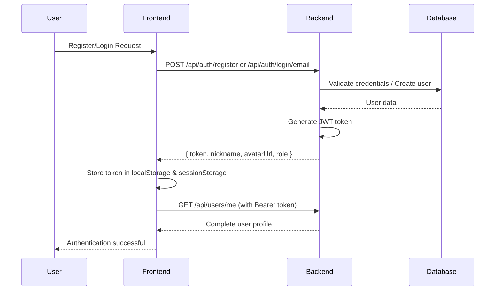

# 🔐 Authentication & Security

> Class: Reference
> Owner: Security/platform maintainer
> Update when: auth flow, JWT behavior, roles, CORS, protected routes, or token storage behavior changes.

This document provides a comprehensive overview of the authentication and security mechanisms implemented in the **Munich Weekly** platform, based on the current codebase implementation.

## 📚 Documentation Navigation

For a risk summary, see [Security Summary](./security-summary.md). For endpoint
contracts, use [API Reference](./api.md).

---

## 1. Overview

The Munich Weekly platform implements a multi-layered security architecture that supports both authenticated and anonymous users:

- **Authenticated Users**: Full access using JWT-based authentication
- **Anonymous Users**: Limited access with anonymous voting capabilities using a backend-signed HttpOnly cookie
- **Role-Based Access Control**: User and admin roles with different permission levels
- **Secure Password Management**: BCrypt hashing with secure password reset functionality

---

## 2. JWT Authentication System

### 2.1. Token Configuration

- **Signing Algorithm**: HS256 (HMAC SHA-256)
- **Default Expiration**: 1 hour (3600000ms)
- **Secret Key**: Configured through the JWT environment settings in [Environment Variables](./environment.md)
- **Library**: `io.jsonwebtoken:jjwt` (version 0.11.5)

### 2.2. Token Structure

```json
{
  "header": {
    "alg": "HS256",
    "typ": "JWT"
  },
  "payload": {
    "sub": "42",        // User ID (primary key)
    "iat": 1714600000,  // Issued at timestamp
    "exp": 1714686400   // Expiry timestamp
  }
}
```

### 2.3. Frontend Token Management

**Storage Strategy**:
- Primary: `localStorage` for persistent authentication
- Fallback: `sessionStorage` for session-based authentication
- Automatic token expiration checking (30-second buffer before actual expiry)

**Token Usage**:
```typescript
// Token retrieval and header generation
const getAuthHeader = (): Record<string, string> => {
  const token = localStorage.getItem("jwt");
  return token ? { Authorization: `Bearer ${token}` } : {};
};
```

**Storage Resilience**:
- Graceful handling of private browsing mode
- Dual storage approach for reliability
- Automatic cleanup on token expiration

---

## 3. Authentication Flow

### 3.1. Registration & Login Flow


```mermaid
sequenceDiagram
    participant U as User
    participant F as Frontend
    participant B as Backend
    participant DB as Database

    U->>F: Register/Login Request
    F->>B: POST /api/auth/register or /api/auth/login/email
    B->>DB: Validate credentials / Create user
    DB-->>B: User data
    B->>B: Generate JWT token
    B-->>F: { token, nickname, avatarUrl, role }
    F->>F: Store token in localStorage & sessionStorage
    F->>B: GET /api/users/me (with Bearer token)
    B-->>F: Complete user profile
    F-->>U: Authentication successful
```

### 3.2. Request Authentication

**Backend Filter Chain**:
1. `JwtAuthenticationFilter` intercepts all requests
2. Extracts token from `Authorization: Bearer <token>` header
3. Validates and parses JWT token
4. Loads user from database and checks ban status
5. Sets Spring Security context with user authentication
6. Continues to controller with authenticated context

**Protected Handler Pattern**:
```java
@PreAuthorize("hasAnyAuthority('user', 'admin')")
public ResponseEntity<?> protectedEndpoint() {
    User currentUser = CurrentUserUtil.getUser();
    // ... endpoint logic
}
```

---

## 4. Anonymous Voting System

### 4.1. Anonymous Vote Identity

**Backend-Signed Cookie**:
- **Cookie Name**: `mw_vote_anon`
- **Value**: server-signed token containing version, anonymous subject, and issued-at timestamp
- **Attributes**: `HttpOnly`, `SameSite=Lax`, `Path=/`, and `Secure` in production
- **Signing Secret**: `ANONYMOUS_VOTE_SECRET`

The frontend no longer creates the authoritative anonymous voting identity.
Voting requests include cookies, and the backend either verifies the signed
cookie, migrates an existing legacy `visitorId` once, or issues a new random
anonymous subject.

Browser vote mutations are CSRF-protected because `mw_vote_anon` is an ambient
cookie. The frontend obtains a token from `GET /api/csrf` and sends the returned
header on `POST /api/votes` and `DELETE /api/votes`. The accompanying
`XSRF-TOKEN` cookie is managed by Spring Security and is not a frontend API;
clients should use the response body token from `/api/csrf` rather than reading
the cookie directly.

Legacy compatibility is intentionally narrow: if a valid `mw_vote_anon` cookie
exists, the backend ignores any changed `visitorId` cookie. If `mw_vote_anon` is
missing and a legacy `visitorId` exists, the backend signs that value into
`mw_vote_anon` for migration.

### 4.2. Vote Constraint Enforcement

**Database Constraint**:
```sql
ALTER TABLE votes ADD CONSTRAINT unique_visitor_submission
UNIQUE (visitor_id, submission_id);
```

**Backend Validation**:
- Checks for existing anonymous vote by signed anonymous subject + `submissionId`
- Issues `mw_vote_anon` when an anonymous browser votes, cancels, or migrates a legacy `visitorId`; cookie-less status checks return not-voted without creating a new identity
- Applies broad in-memory throttles to excessive anonymous token issuance and repeated anonymous vote attempts per client address and submission; these controls are not a one-IP-one-vote rule

### 4.3. Anonymous photo submissions (distinct from cookie-based voting)

**Turnstile (Cloudflare):** `POST /api/submissions/anonymous` requires a valid `captchaToken`. The backend verifies it with Turnstile’s siteverify API using `TURNSTILE_SECRET_KEY`. The frontend needs `NEXT_PUBLIC_TURNSTILE_SITE_KEY` for the widget. The value is for bot/human checks only, not for building a user session.

**Internal user record:** each anonymous submission is tied to a **synthetic `User`** with `accountType = ANONYMOUS_SUBMISSION` so `submissions.user_id` stays a valid FK. That row cannot be used to log in; password-reset handling does not treat it like a member account. Admin user listing **excludes** these accounts from the normal “all users” view.

**Upload token:** after the shell `Submission` is created, the API returns a **short-lived upload token** and the client posts the image to `.../anonymous-upload` with `X-Anonymous-Upload-Token`. It authorizes a **single** image for that `submissionId` and is **not** a substitute for `Authorization: Bearer` JWT on other endpoints.

**Submitters** using this flow have no in-app history for that row (no “my submissions” for the synthetic user).

API details: [API reference](./api.md).

---

## 5. Security Configuration

### 5.1. Spring Security Setup

Security rules are enforced in
`backend/src/main/java/com/munichweekly/backend/security/SecurityConfig.java`
and method-level `@PreAuthorize` annotations. Do not maintain public/protected
endpoint inventories by hand in Markdown; use [API Reference](./api.md), the
generated [api.json](./api.json), and the backend security config as the current
facts.

Spring CSRF protection is enabled for cookie-backed vote mutations. JWT-protected
API calls continue to use explicit `Authorization: Bearer ...` headers rather
than browser-ambient authentication cookies.

### 5.2. Error Handling

**401 Unauthorized**:
```json
{
  "error": "Unauthorized - Please login first."
}
```

**403 Forbidden**:
```json
{
  "error": "Forbidden - You do not have permission."
}
```

**Frontend Error Handling**:
- Automatic token cleanup on certain 401 errors
- Preservation of authentication state during navigation
- Graceful degradation for storage access issues

---

## 6. Role-Based Access Control

### 6.1. User Roles

| Role    | Capabilities |
|---------|-------------|
| `user`  | Vote, view profile, submit photos, manage own content |
| `admin` | All user capabilities + manage issues, approve submissions, view all users, access admin panel |

### 6.2. Permission Enforcement

**Backend**:
```java
@PreAuthorize("hasAuthority('admin')")
public ResponseEntity<?> adminOnlyEndpoint() { ... }
```

**Frontend Route Protection**:
```typescript
<ProtectedRoute requiredRole="admin">
  <AdminPanel />
</ProtectedRoute>
```

---

## 7. Password Security

### 7.1. Password Hashing

- **Algorithm**: BCrypt with Spring Security's default strength
- **Implementation**: `BCryptPasswordEncoder`
- **Salt**: Automatically generated per password

### 7.2. Password Reset System

**Flow**:
1. User requests reset via email
2. Server generates secure UUID token with 30-minute expiration
3. Reset email sent via Mailjet with secure link
4. Token validated and marked as used after successful reset

**Security Features**:
- One-time use tokens
- Time-limited validity (30 minutes)
- Secure random token generation
- Email delivery via Mailjet API

---

## 8. Frontend Security Measures

### 8.1. Authentication Context Management

**Features**:
- Automatic token expiration detection
- Secure storage fallback mechanisms
- Protection against private browsing mode issues
- Automatic user data refresh and synchronization

### 8.2. Route Protection

**Implementation**:
- `ProtectedRoute` component for access control
- Automatic redirect to login with return path preservation
- Loading states during authentication checks
- Graceful handling of authentication failures

### 8.3. Request Security

**CORS and Credentials**:
```typescript
fetch(url, {
  credentials: 'include',    // Include cookies for anonymous voting
  headers: {
    'Authorization': `Bearer ${token}`,
    'Content-Type': 'application/json'
  }
});
```

---

## 9. Security Best Practices Implemented

### 9.1. Token Security
- ✅ Short token expiration (1 hour)
- ✅ Secure secret key configuration
- ✅ Automatic token cleanup on expiration
- ✅ HMAC signing algorithm (HS256)

### 9.2. User Data Protection
- ✅ BCrypt password hashing
- ✅ Input validation on all endpoints
- ✅ Ban status checking during authentication
- ✅ Secure password reset with time-limited tokens

### 9.3. Anonymous User Privacy
- ✅ Backend-signed HttpOnly anonymous vote identity
- ✅ No personal data collection for anonymous users
- ✅ Cookie-based state management with appropriate security settings
- ✅ Transparent data handling as documented in privacy policy

### 9.4. Infrastructure Security
- ✅ Environment variable configuration for secrets
- ✅ HTTPS enforcement in production
- ✅ Secure email delivery via Mailjet
- ✅ Database constraint enforcement

---

## 10. API Security Reference

Endpoint paths, request/response schemas, and security metadata belong in
[API Reference](./api.md) and [api.json](./api.json). This document explains
authentication behavior and security design, not the route inventory.

---

## 11. Security Considerations & Limitations

### 11.1. Current Limitations
- JWT tokens are stored in localStorage (vulnerable to XSS attacks)
- No refresh token mechanism implemented
- Single secret key for all token signing
- Anonymous vote throttling uses in-memory counters per backend JVM

### 11.2. Recommended Improvements
1. **Implement refresh token rotation** for enhanced security
2. **Move JWT to httpOnly cookies** to prevent XSS attacks
3. **Move in-memory throttles to shared storage** if the backend runs multiple JVMs
4. **Implement CSP headers** for additional XSS protection
5. **Add request signing** for critical operations
6. **Implement session management** for better token lifecycle control

### 11.3. Privacy Compliance
- ✅ GDPR-compliant anonymous voting system
- ✅ Right to data deletion implemented
- ✅ Transparent data collection practices
- ✅ Minimal data collection approach
- ✅ Secure data storage in EU (Germany/Hetzner Cloud)

---

This document reflects the current implementation as of the latest codebase analysis. For implementation details, refer to the source code in `/backend/src/main/java/com/munichweekly/backend/security/` and `/frontend/src/context/AuthContext.tsx`.

---

## 🔗 Additional Resources

### Implementation References
- **Backend Security Code**: `/backend/src/main/java/com/munichweekly/backend/security/`
- **Frontend Auth Context**: `/frontend/src/context/AuthContext.tsx`
- **Anonymous Voting**: `/backend/src/main/java/com/munichweekly/backend/service/AnonymousVoteIdentityService.java`
- **Route Protection**: `/frontend/src/components/ProtectedRoute.tsx`

### Related Documentation
- 📊 [Security Summary](./security-summary.md) - Executive overview and improvement roadmap
- 🗃️ [Database Design](./database.md) - Security constraints and data model
- 💾 [Storage System](./storage.md) - File upload security and access control
- 🔧 [Admin Guide](./admin-guide.md) - Administrative security features

### Security Resources
- 🛡️ [Privacy Policy](./privacy.md) - Data protection and GDPR compliance
- 🚀 [Deployment Guide](./deployment.md) - Production security configuration
