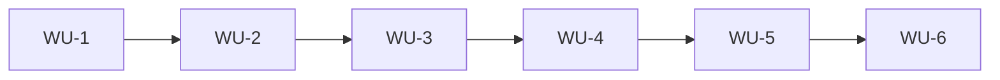

# 前端精简重构计划（Subagent-Driven）

> 分支：`refactor/frontend-dedup-plan`  
> 图谱：`graphify-out/GRAPH_REPORT.md`（commit `62acb0c9`）  
> 契约护栏：`docs/refactor-baseline.md`  
> 原则：**小步 PR、行为不变、每步可验证**

## 1. 目标与边界

### 目标

- 减少重复 UI / Hook / 页面内联逻辑
- 降低 God Node 扇出（尤其 `fetchAPI`、`useImageDimensions`、巨型 page）
- 保持用户可见功能与 API 契约稳定

### 不在本批次范围

- 后端大规模重构（除非前端契约需要）
- 更换状态管理库、路由方案
- 视觉 redesign
- 强行把所有 FormData/raw fetch 塞进 JSON 版 `fetchAPI`

## 2. 现状（Graphify + 代码）

### 已完成（勿重复劳动）

见 `docs/refactor-baseline.md`：

- `galleryApi` → `fetchAPI` 统一
- `LoadingErrorStates` / `IssueSelector` 合并到 `components/ui/`，admin 薄 re-export
- `manage-submissions` 拆分为 orchestration hook + 子组件
- 部分后端 DTO 化（issue/user）

### 核心 God Nodes（前端）

| 节点 | 路径 | 风险 |
|------|------|------|
| `fetchAPI` | `api/http.ts` | 改签名影响全站 |
| `cn` | `lib/utils.ts` | 低 |
| `getAuthHeader` | `api/http.ts` | 中（仍有直接调用） |
| Gallery DTO 族 | `api/gallery/types.ts` | 中（类型扩散） |
| `useAuth` | `context/AuthContext.tsx` | 高 |
| `Submission` 类型 | `types/submission.ts` | 中 |

### 重复热点（待处理）

1. **ImageViewer 双实现**：`submission/ImageViewer.tsx` vs `gallery/GalleryImageViewer.tsx`
2. **卡片双轨**：`SubmissionCard.tsx` vs `MasonrySubmissionCard.tsx`
3. **巨型页面**：`data-migration/page.tsx`（812）、`gallery-settings/issues/page.tsx`（613）、`gallery-settings/page.tsx`（526）、`submit/page.tsx`（477）
4. **巨型 Hook**：`useImageDimensions.ts`（707）
5. **HTTP 分裂**：debug、migration、account、promotion 等仍 raw `fetch`
6. **Import 路径分裂**：部分页面仍引 `admin/submissions/*` 而非 `ui/*`

## 3. 执行模型（Subagent-Driven）

每个 Work Unit（WU）固定流程：

```
Planner（主会话）→ Implementer subagent → Reviewer subagent → 主会话合并
```

### Subagent 分工

| 角色 | 类型 | 输入 | 输出 |
|------|------|------|------|
| Implementer | `generalPurpose` | WU 范围 + baseline + GRAPH_REPORT 社区 | PR 级 diff |
| Reviewer | `code-reviewer` | diff + baseline 清单 | 通过/阻塞项 |
| Explorer（可选） | `explore` | 单文件依赖 | 调用方列表 |

### 每 WU 必跑验证

```bash
cd frontend && npm run lint && npm run build
```

按 `refactor-baseline.md` 跑对应 **Critical Manual Flows**。

## 4. Work Units（按风险升序）

### WU-1：Debug 与 import 卫生（低风险）

**范围**

- `hooks/useDebugTools.ts`：改用现有 `issuesApi` / `submissionsApi`
- `manage-submissions` 子组件统一 import `@/components/ui/*`（保留 admin re-export 文件不删）

**不改**：`components/admin/submissions/*` 对外路径

**验证**：Manage Submissions → Debug Tools → Test API Connection

---

### WU-2：Gallery Settings 页面组件化（低–中）

**范围**

- 拆分 `app/account/gallery-settings/page.tsx`
- 拆分 `app/account/gallery-settings/issues/page.tsx`
- 新增 admin hooks + 子组件

**不改**：`@/api/gallery/galleryApi` 导出面

**验证**：Gallery Settings CRUD、Issue Management

---

### WU-3：`useImageDimensions` 拆分（中）

**范围**：拆模块 + barrel，保持 export 签名

**验证**：Vote masonry、Gallery 宽图、CLS

---

### WU-4：Submit 页 orchestration（中）

**范围**：`hooks/useSubmitOrchestration.ts`；保留 `resetAnonymousCaptcha()` 行为

**验证**：登录/匿名提交、captcha 重置

---

### WU-5：ImageViewer 共享核心（中–高）

**范围**：`useFullscreenImageViewer` + 两 Viewer 共用

**验证**：Vote、Gallery、manage-submissions、移动端缩放

---

### WU-6：Data Migration API + 页面拆分（高）

**范围**：`api/admin/migration.ts` + 面板组件；用共享 `Issue` 类型

**验证**：migration 流程 + 后端 migration 测试

## 5. 依赖图（执行顺序）



WU-1 与 WU-2 可并行（无文件重叠）。

## 6. 契约红线

- `@/api/gallery/galleryApi` 路径与 default export
- Vote / users/me / Issue 字段集
- 匿名上传 token + credentials
- FormData 上传不 JSON 化

## 7. 成功标准

- 6 个 WU 各自可 review/merge
- 每步 lint + build 绿
- baseline 手动清单通过
- 会话末 `graphify update .`

## 8. 进度（2026-05-19）

- [x] **WU-1** — `useDebugTools` 改用 `getAllIssues` / `getAllSubmissionsByIssue`；manage-submissions 子组件改引 `@/components/ui/*`
- [x] **WU-2** — Gallery Settings 两页拆分为 hooks + `components/gallery/admin/*`（526→115，613→134 行）
- [x] **WU-3** — `useImageDimensions` 拆为 `hooks/imageDimensions/*` + barrel re-export
- [ ] WU-4 Submit orchestration
- [ ] WU-5 ImageViewer 共享核心
- [ ] WU-6 Data Migration

## 9. 下一步

WU-4～6 待用户确认后继续。
